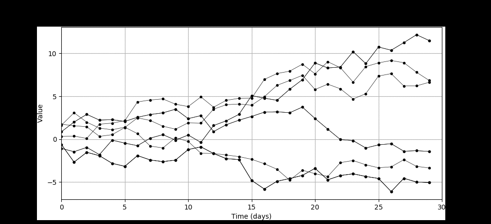

Large-scale weather generator
=============================

.. image:: https://travis-ci.org/tnipen/wxgen.svg?branch=master
  :target: https://travis-ci.org/tnipen/wxgen
.. image:: https://coveralls.io/repos/tnipen/wxgen/badge.svg?branch=master&service=github
  :target: https://coveralls.io/github/tnipen/wxgen?branch=master

``wxgen`` is a command-line tool that generates arbitrarily long trajectories (time-series) of weather data. It samples a database of shorter time-series and joins these together to form long trajectories. The database contains short trajectories produced by, for example, numerical weather prediction models.

Longer trajectories are created by concatinating the shorter trajectories from the database. This is done by matching the end state of one trajectory with the beginning state of another. The matching is done using a specified metric, such as the sum of the square differences  between states (with some kind of normalization strategy  as each atmospheric variable has different variances).

Installation
------------

**Ubuntu**

Install the required pacakges:

.. code-block:: bash

  sudo apt-get install python-numpy python-scipy python-matplotlib python-setuptools

Then install ``wxgen`` by executing the following inside the extracted folder:

.. code-block:: bash

  sudo python setup.py install

This will create the executable ``/usr/local/bin/wxgen``.  Add this to your PATH environment
variable if necessary (i.e add ``export PATH=/usr/local/bin/:$PATH`` to ``~/.bashrc``). If you do
not have sudo privileges do:

.. code-block:: bash

  sudo python setup.py install --user

This will create the executable ``~/.local/bin/wxgen``. Add the folder to your PATH environment
variable.

Example
-------

.. code-block:: bash

   wxgen -n 10 -t 30

